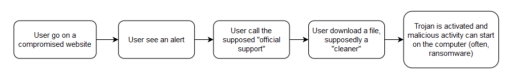

# File 1

## Filename 

0d11a13f54d6003a51b77df355c6aa9b1d9867a5af7661745882b61d9b75bccf

## Md5 Hash

d2b5a2547e2246694148ece3cf74de0e

## General summary about particular sample (your ideas and ..)

This file contain a Trojan called Rombertik. It is a newer version of Carbon FormGrabber.

It is a .zip that contain approximately 97% of unused data, and a .SCR (screensaver executable)

The goal is to get sentive information and credentials in the user's browser, but Rombertik will collect any data it can.

## General characteristic
* Delivery method : phishing email / spam
* If detect that it is analyse it will try to overwrite the master boot record / if it fails, it encrypte all files in the home folder with a randomly generated key
* Ultimately designed to steal user's data

Rombertik can spy on data event is the connexion is secure with https, as it collects the data before its encryption.

## Antivirus detection results 

Majority of antivirus detect Rombertik (approximately 2/3). Some of them can't process the files, and a few doesn't detect any threat, but it seems that these are more Mobile based antivirus, and Rombertik is dangerous for windows operating system.

https://www.virustotal.com/gui/file/0d11a13f54d6003a51b77df355c6aa9b1d9867a5af7661745882b61d9b75bccf/community

https://www.hybrid-analysis.com/sample/0d11a13f54d6003a51b77df355c6aa9b1d9867a5af7661745882b61d9b75bccf

## File System IOC (indicator of compromise)

Rombertik writes the file `%SystemDrive%\Documents and Settings\All Users\Start Menu\Programs\Startup\[RANDOM CHARACTERS].vbs` so it can run every times windows start.

`%AppData%\rsr\yfoye.exe.` contain the packed version of rombertik

## Network IOC

Control server is centozos[dot]org[dot]in, so if a connection is made to this server that can mean the computer is infected

The following email-address is found in memory after analyse : `info@netmastersllc.com`

## Registry IOC

Rombertik adjust `SE_DEBUG_PRIVILEGE`

## Behavior and control flow
* Anti-analysis check -> if not in a sandbox
* If not in a sandbox, it decrypts and install itself on the computer
* Then it launch a copy and overwrite it with the core functionality
* Before beginning to spy, Rombertik check again if its not being analysed
* If the check fail, try to destroy the master boot record,  or encrypte all the files in the home folder if it does not have the administrator rights

If Rombertik deteck being in a sandbox, it will write a random octet 960 millions times, which lead to a file of more than 100Go. Most of sandbox detection tools doesn't detect this activity as suspicious. If the sandbox still work after Rombertik finished writing this file, it will stop. If not, Rombertik will launch several other tools to help itself escape from the sandbox.

In term of control flow, Rombertik unpacked code's contain a fair amount of overlapping function and jump, which result in a control flow of hundreds of nodes.

<figure>
  
  <figcaption>On the left, the control flow chart of the code that detect analysis. On the right, the control flow chart of the unpacked code of Rombertik  <a href="https://blogs.cisco.com/security/talos/rombertik">Source : Cisco Talos</a></figcaption>
</figure> 

## Appendix (links to analyses, etc)

[https://blogs.cisco.com/security/talos/rombertik](https://blogs.cisco.com/security/talos/rombertik)

[https://www.hybrid-analysis.com/sample/77bacb44132eba894ff4cb9c8aa50c3e9c6a26a08f93168f65c48571fdf48e2a](https://www.hybrid-analysis.com/sample/77bacb44132eba894ff4cb9c8aa50c3e9c6a26a08f93168f65c48571fdf48e2a)

[https://www.tripwire.com/state-of-security/security-data-protection/cyber-security/rombertik-a-master-of-evasive-malware-techniques/](https://www.tripwire.com/state-of-security/security-data-protection/cyber-security/rombertik-a-master-of-evasive-malware-techniques/)

[https://www.nextinpact.com/article/17948/94036-rombertik-spyware-qui-pratique-terre-brulee-sil-est-detecte](https://www.nextinpact.com/article/17948/94036-rombertik-spyware-qui-pratique-terre-brulee-sil-est-detecte)

# File 2

## Filename 

27423.jse

## Md5 Hash

f7cdc866e97ff90b37108dcd3622eba1

## General summary about particular sample (your ideas and ..)

It's a `.jse` script, or more precisely a `VBScript Encoded scrip`, the term `Cryxos` is found several time in the name of the threat detected by the antiviruses. The name `nemucod` is also cited in the comments and the analyses, but it is a very generic name.

## General characteristic

* Distribution method : Compromised websites, rogue online pop-up ads, potentially unwanted applications
* Type of message displayed : "Computer / web browser has been blocked due to a virus infection", "Data has been stolen", "Threat detected on the computer"
* Idea is to scare the user so he act without thinking
* It is a call support scam : the user is asked to call a number in order to respond to the threat / protect his data or remove the virus
* In the call they will try to convince the user to download a cleaner or something equivalent

## Antivirus detection results

Most of the antivirus detect the trojan. 

[https://www.virustotal.com/gui/file/c0880cb0044d0a226b55e6f40a07e4c563c39c5eeb4824f0e3d95389d0b79691](https://www.virustotal.com/gui/file/c0880cb0044d0a226b55e6f40a07e4c563c39c5eeb4824f0e3d95389d0b79691)

[https://www.hybrid-analysis.com/sample/c0880cb0044d0a226b55e6f40a07e4c563c39c5eeb4824f0e3d95389d0b79691](https://www.hybrid-analysis.com/sample/c0880cb0044d0a226b55e6f40a07e4c563c39c5eeb4824f0e3d95389d0b79691)

[https://cuckoo.cert.ee/submit/post/3175275](https://cuckoo.cert.ee/submit/post/3175275)

## File System IOC (indicator of compromise)

Nemucod touches several files in `%WINDIR%%\System32\`

## Network IOC

Contact `centweek.top` (DNS request made to resolve this domain name)

## Registry IOC

Read the computername and the machineGUID registry. Also read the langage used by the system.

## Behavior and control flow

* Display false virus or error alert, asking the user to call a phone number in order to protect their data / computer (phone number is supposed to be technical support)
* The aim is to trick the user into paying for the assistance or to make the user purchase a software

<figure>
  
  <figcaption>Flowchart for this trojan</figcaption>
</figure> 

## Appendix (links to analyses, etc)

https://www.f-secure.com/v-descs/trojan_js_cryxos.shtml

# File 3

## Filename 
cIYirg.hta

## Md5 Hash

16bfd3ad454a4222de43fc5f1dc494ed 

## General summary about particular sample (your ideas and ..)

It seems that this is another Trojan Downloader.  It is a .hta witch is a HTML file that can be executed via Microsoft HTML Application Host.

## General characteristic

* Contain obfuscated code 
* The names nemucod and Locky are cited several times in community comments; we can assume that ransomware are the type of malware downloaded by this file

## Antivirus detection results

Fairly more than half of the antivirus detected this file as a threat. 

[https://www.virustotal.com/gui/file/7a6979882d64b349779747a8e87ac4361c8f2f5ec85582f54fb124ab1c3de633](https://www.virustotal.com/gui/file/7a6979882d64b349779747a8e87ac4361c8f2f5ec85582f54fb124ab1c3de633)

[https://www.hybrid-analysis.com/sample/7a6979882d64b349779747a8e87ac4361c8f2f5ec85582f54fb124ab1c3de633](https://www.hybrid-analysis.com/sample/7a6979882d64b349779747a8e87ac4361c8f2f5ec85582f54fb124ab1c3de633)

[https://cuckoo.cert.ee/submit/post/3175474#](https://cuckoo.cert.ee/submit/post/3175474#)

## File System IOC (indicator of compromise)

We can find modification in files related to the history, the cache, and the cookies of Internet Explorer, probably to hide its presence.

## Network IOC

3 DNS request marked as "malicious":
* www.luigigiordano.org ( 213.205.40.169 )
* www.fmpromedia.com ( 195.78.215.76 )
* www.kreso.it ( 213.205.40.169 )

In addition to resolving this domains names, `fmpromedia` and `kreso` were also contacted.

`Suricata` (network threat detection engine) labelled those connection as malicious in the category `A Network Trojan was detected`

## Registry IOC

Modify the proxy settings, and read the `DISABLESECURITYSETTINGSCHECK`for Internet Explorer.

## Behavior and control flow

The analyse from `cuckoo.cert.ee` indicate that a thread was resumed because it was potentially an `indication of process injection`.

Seems to use internet cache setting to hide information that could be found in index.dat : we can find a query in the cache settings.

## Appendix (links to analyses, etc)

[https://www.f-secure.com/v-descs/trojan_js_obfuscated_gen.shtml](https://www.f-secure.com/v-descs/trojan_js_obfuscated_gen.shtml)