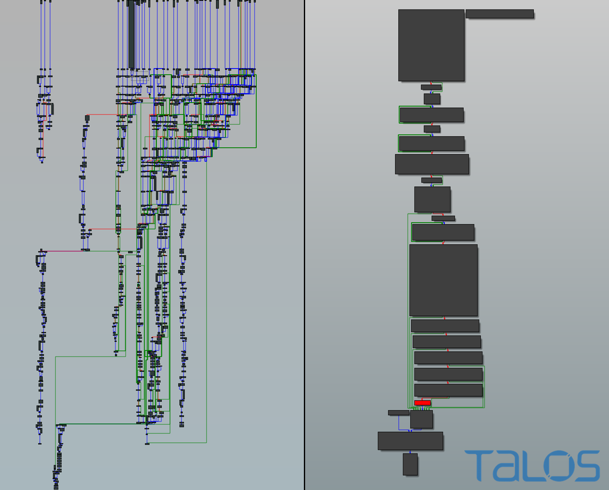

# File 1

## Filename 

0d11a13f54d6003a51b77df355c6aa9b1d9867a5af7661745882b61d9b75bccf

## Sha256 or md5 Hash

d2b5a2547e2246694148ece3cf74de0e

## General summary about particular sample (your ideas and ..)

This file contain a Trojan called Rombertik. It is a newer version of Carbon FormGrabber.

It is a .zip that contain approximately 97% of unused data, and a .SCR (screensaver executable)

The goal is to get sentive information and credentials in the user's browser, but Rombertik will collect any data it can.

## General characteristic
* Delivery method : phishing email / spam
* If detect that it is analyse it will try to overwrite the master boot record / if it fails, it encrypte all files in the home folder with a randomly generated key
* Ultimately designed to steal user's data

Rombertik can spy on data event is the connexion is secure with https, as it collects the data before its encryption.

## Antivirus detection results 

Majority of antivirus detect Rombertik (approximately 2/3). Some of them can't process the files, and a few doesn't detect any threat, but it seems that these are more Mobile based antivirus, and Rombertik is dangerous for windows operating system.

https://www.virustotal.com/gui/file/0d11a13f54d6003a51b77df355c6aa9b1d9867a5af7661745882b61d9b75bccf/community

https://www.hybrid-analysis.com/sample/0d11a13f54d6003a51b77df355c6aa9b1d9867a5af7661745882b61d9b75bccf

## File System IOC (indicator of compromise)

Rombertik writes the file `%SystemDrive%\Documents and Settings\All Users\Start Menu\Programs\Startup\[RANDOM CHARACTERS].vbs` so it can run every times windows start.

`%AppData%\rsr\yfoye.exe.` contain the packed version of rombertik

## Network IOC

Control server is centozos[dot]org[dot]in, so if a connection is made to this server that can mean the computer is infected

The following email-address is found in memory after analyse : `info@netmastersllc.com`

## Registry IOC

Rombertik adjust `SE_DEBUG_PRIVILEGE`

## Behavior and control flow
* Anti-analysis check -> if not in a sandbox
* If not in a sandbox, it decrypts and install itself on the computer
* Then it launch a copy and overwrite it with the core functionality
* Before beginning to spy, Rombertik check again if its not being analysed
* If the check fail, try to destroy the master boot record,  or encrypte all the files in the home folder if it does not have the administrator rights

If Rombertik deteck being in a sandbox, it will write a random octet 960 millions times, which lead to a file of more than 100Go. Most of sandbox detection tools doesn't detect this activity as suspicious. If the sandbox still work after Rombertik finished writing this file, it will stop. If not, Rombertik will launch several other tools to help itself escape from the sandbox.

In term of control flow, Rombertik unpacked code's contain a fair amount of overlapping function and jump, which result in a control flow of hundreds of nodes.

<figure>
  
  <figcaption>On the left, the control flow chart of the code that detect analysis. On the right, the control flow chart of the unpacked code of Rombertik  <a href="https://blogs.cisco.com/security/talos/rombertik">Source : Cisco Talos</a></figcaption>
</figure> 

## Appendix (links to analyses, etc)

[https://blogs.cisco.com/security/talos/rombertik](https://blogs.cisco.com/security/talos/rombertik)

[https://www.hybrid-analysis.com/sample/77bacb44132eba894ff4cb9c8aa50c3e9c6a26a08f93168f65c48571fdf48e2a](https://www.hybrid-analysis.com/sample/77bacb44132eba894ff4cb9c8aa50c3e9c6a26a08f93168f65c48571fdf48e2a)

[https://www.tripwire.com/state-of-security/security-data-protection/cyber-security/rombertik-a-master-of-evasive-malware-techniques/](https://www.tripwire.com/state-of-security/security-data-protection/cyber-security/rombertik-a-master-of-evasive-malware-techniques/)

[https://www.nextinpact.com/article/17948/94036-rombertik-spyware-qui-pratique-terre-brulee-sil-est-detecte](https://www.nextinpact.com/article/17948/94036-rombertik-spyware-qui-pratique-terre-brulee-sil-est-detecte)