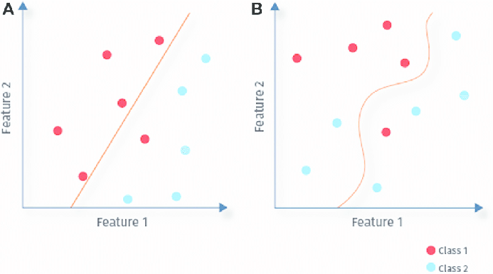

# Notes on CM2

3 type of learning : supervised / unsupervised / semisupervised

**4 components for learning methods**

* Dataset
* Loss fct°
* ???
* ???

##  Supervised : what is it ?

you have input `x` and output `y` and the algorithm need to learn the mapping from x to y

**Goal : approximate the mapping function (`Y = f(x)`)**

In order to learn we use a **lost of cost function**, that determined the distance btw the output found by algorithm and the expected output

With new dataset we can use the mapping fct°

## 2 Groups of supervised learning

* Regression : output is a numerical real value (ex: predict the age) (continue variable output)
* Classification : output is a catagory (discrete variable output)

<figure>
  
  <figcaption>Fig.1 - Regression or classification</figcaption>
</figure> 

Exemples of algos :

* Linear and logistic regression
* Random forest, KNN : k nearest neighbour (classification & regression problems)
* Support vector machines (non linear problems)

We are gonna focus on **classification**

### Linear problem

In 2D if we draw x and y and there is a lineqr separation its a linear problem 

If u cant draw a straight line it's not linear

<figure>
  
  <figcaption>Fig.2 - Example of linear problem or not</figcaption>
</figure> 

`Input` are independant and `output` is dependant on the inputs

### Logistic regression

Linear model + sigma method (mapping fct°)

Coefficient on the feature to obtain the mapping fct°

In logistic regression we convert the output of the mapping fct° to an probability to be a certain category

Coef are calcualted and ajusted using the **loss fct°** : error for a single training example

**Cost fct°** : avg of the loss fct° for all training example

For exemple the loss fct° can be :

    Error = sum( (calculated_output - predicted_output) ^2)

The aim is to find the coef that give us the minimum cost

### Gradient descent

<pre>wnew =  wold - learning_rate*(d cost / dw)</pre>

<figure>
  
  <figcaption>Fig.3 - Principe of gradient descent</figcaption>
</figure> 

We try to minimize the cost value : we see how the cost reduce about time 

When choosing the learning_rate carefull to not overfeet or underfeet

**Learning rate** : btw 0.1 and 0.0001 -> can change and depend on the results

### KNN

Pros :

* easy to implement
* no need to train as we just need to define k
* no prior knwoledge of data
* both for classification and regression

Cons:

* Computionally exprensive
* Variables needs to be normalized or high range values can be a problem
* get slower with increase of size / features
* high memory consumption
* sensitive to irrevelant features

Applications :
* Recommandation systems (Netflix, Amazon) -> big system require higly scalable sol
* Disease detection
* Concept search : search for similar documents

### Support vector machine

Only for classidication problems

The idea is to find a hyperplane to separate at best our data

Several hyperplans can work : find the one with the biggest margin

The max distance is determined by the data point closet to the plane : those sample are support vectors

Support vectors are critical to the model and if deleted can totally change the output

<figure>
  
  <figcaption>Fig.4 - SVM principe</figcaption>
</figure>

We data is mixed we add a dimension

Pros :

[to complete - lecture 1 pdf]