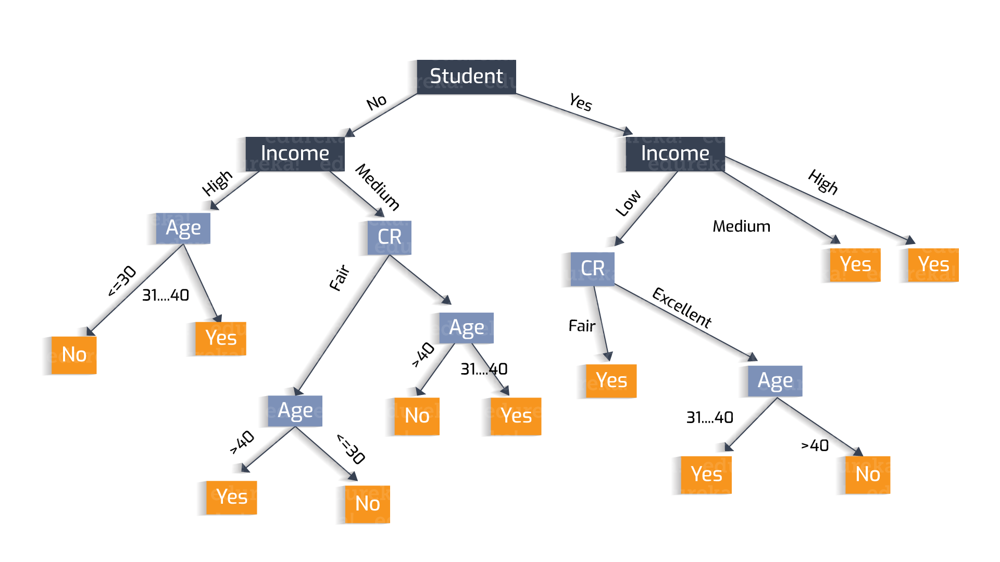
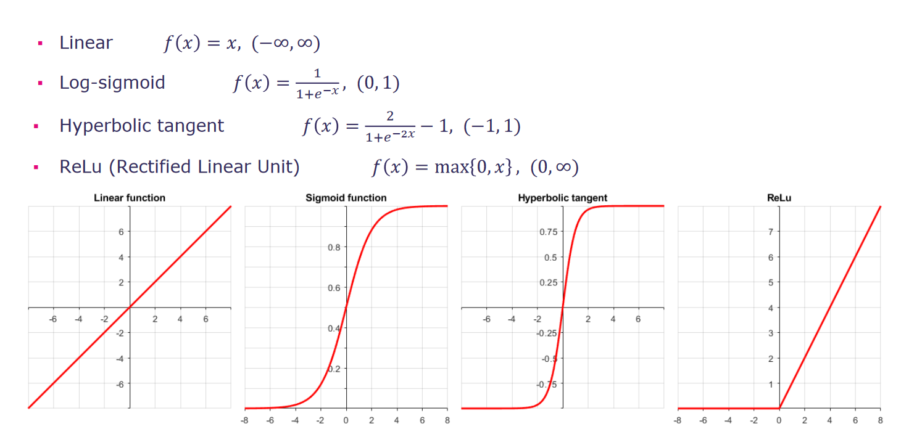

# Notes CM3

## Theoreme de Bayes

    p(A|B) = p(B|A)p(A) / p(B)

## Naive Bayes

<figure>
  
  <figcaption>Fig.1 - Naive Bayes explenation</figcaption>
</figure> 

## Decision tree

Branch represent the outcome of the test and leafs represent a class data

<figure>
  
  <figcaption>Fig.2 - Exemple of a decision tree</figcaption>
</figure> 

Training a model = growing a tree

### Gini Index

Probability of a particular variable to be wrongly classified
<pre>
    G = - sumfrom 1 to k(pi*(1-pi))
</pre>

### Information gain

Entropy :
* if 0, completely homegenous
* if 1, it's 50%-50%
<pre>
    H(p)= - sumfrom 1 to k(pilog2pi)
</pre>

The lesser the entropy the better it is : we can choose entropy as a decision factor on decision trees

### Chi square

### Avantages decision tree

* Easy to interpret, graphical representation
* map nonlinear relations quit well
* implicity perform feature selection
* handle both numerical and categorical data

### Disavantages decision tree

* may suffer from overfitting
* not fit for continuous numerical var
* if a class dominate the tree is biased
* greedy algo cannot garantee the globally optimal decision tree

## Neural networks

Called perceptrion : mathematical model for a single neuron

<pre>
    y = f (sumfrom j=1 to dwjxj)
</pre>

### ANN : commonly used activation fct°

### Main stage of neural network training

* initialization
* forward propagation
* error fct°
* backpropagation
* weight update
* iterate until converenge

### ANN : pros

* effectively identifies complex relationship btw input and output
* handle noisy data

### ANN : cons

* interpreation of the obtained model is hard
* prone to overfitting
* can converge to a local minima
* training can be computationnaly expensive